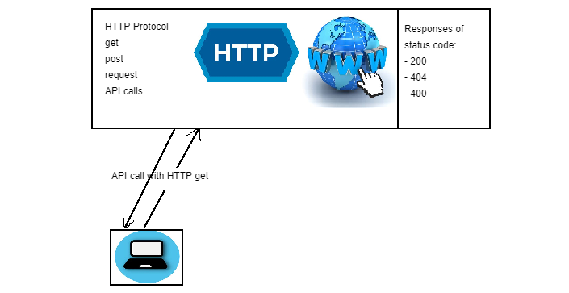

## Python with DB
### Apply CRUD - Create, Read, Update, Delete


### To establish the connection between Python and SQL we will use PYODBC
`import pyodbc`

### Let's establish the connection using PYODBC
`server = "18.135.103.95"
database = "Northwind"
username = "SA"
password = "Passw0rd2018"
docker_Northwind = pyodbc.connect('DRIVER={ODBC Driver 17 for SQL Server};'
                                  'SERVER='+server+';DATABASE='+database+';UID='+username+';PWD='+ password)
`
### Let's check if the connection is validated and cursor object is created
`cursor = docker_Northwind.cursor()
print(cursor.execute("SELECT @@version;"))`


### Let's fetch some data from Northwind DB
`row = cursor.fetchone() 
print(row)`
#
### Let's connect to our DB and fetch some data from Customer table
`cust_rows = cursor.execute("SELECT * FROM Customers").fetchall()
print(cust_rows)`
### We use execute to run our queries within a string
### fetchall() gets all the data from the table

`prod_rows = cursor.execute("SELECT * FROM Products").fetchall()`
### Let's iterate through the Product table and check the UnitPrice available
 `for records in prod_rows:
    print(records.UnitPrice)`

`row = cursor.execute("SELECT * FROM Products")
while True:
    record = row.fetchone()
    if record is None:
        break
    print(record.UnitPrice)`

### Useful link to help PYODBC installation:
- `https://docs.microsoft.com/en-gb/sql/connect/odbc/download-odbc-driver-for-sql-server?view=sql-server-ver15`
-  

### SQL TASK: get user input, check website status code, display information to user.
- import requests, create a class, initialize url
```python
import requests
class NewBooks:
    def __init__(self):
        self.url = "https://openlibrary.org/books/"
        self.greetings()
        self.books = input("Please enter book id that you're interested in: ")
    # use this id to check: OL7353617M
```
- greet the user
```python
    def greetings(self):
        print("Hello User!")
```
- check the status of the website
```python
    def check_status(self):
        url_arg = self.url + self.books
        print(url_arg)
        status = requests.get(url_arg).status_code
        if status == 200:
            print("The website is running, and the status code is: " + str(status))
        else:
            print("Something wrong")
```
- call functions
```python

book = NewBooks()
book.greetings()
book.check_status()
```
    


